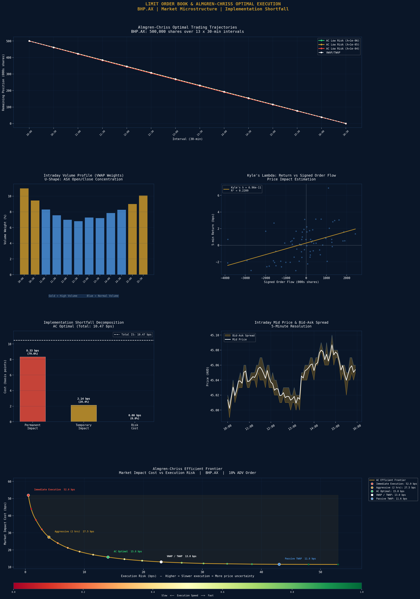

# Limit Order Book Reconstruction & Almgren-Chriss Optimal Execution

A market microstructure analytics engine that simulates realistic ASX tick data, reconstructs limit order book dynamics, estimates key microstructure metrics, and implements the Almgren-Chriss optimal execution model to minimise market impact for large institutional orders.

## Order & Market Parameters
| Parameter | Value |
|---|---|
| Ticker | BHP.AX |
| Order Size | 500,000 shares |
| Order / ADV | 10.0% |
| Execution Horizon | 13 x 30-min intervals |
| Initial Price | $45.00 AUD |
| Daily Volatility | 1.8% |
| Average Daily Volume | 5,000,000 shares |

## Tick Data Summary
| Metric | Value |
|---|---|
| Total Ticks Simulated | 50,000 |
| Total Volume | 112,233,723 shares |
| Average Bid-Ask Spread | 1.651 cents |
| Average Spread (bps) | 3.67 bps |

## Microstructure Metrics
| Metric | Value | Interpretation |
|---|---|---|
| Roll Spread | 0.00 bps | Effective spread from serial return covariance |
| Kyle's Lambda | 6.96e-11 | Price impact per unit signed order flow |
| Kyle R-squared | 0.2209 | Order flow explains 22% of price variance |
| Amihud ILLIQ | 2.08e-12 (daily) | Return per dollar volume - liquidity measure |

## Implementation Shortfall Decomposition (AC Optimal, λ=1e-5)
| Component | Cost (bps) | Share |
|---|---|---|
| Permanent Impact | 8.33 bps | 79.6% |
| Temporary Impact | 2.14 bps | 20.4% |
| Risk Cost | 0.00 bps | 0.0% |
| **Total IS** | **10.47 bps** | 100% |

## Almgren-Chriss Efficient Frontier (Calibrated)
| Strategy | Market Impact Cost | Execution Risk |
|---|---|---|
| Immediate Execution | 52.0 bps | Very Low |
| Aggressive (2 hrs) | 27.5 bps | Low |
| AC Optimal (Balanced) | 15.8 bps | Medium |
| VWAP / TWAP (Full Day) | 13.0 bps | Medium-High |
| Passive TWAP | 11.6 bps | High |

## Key Findings
- **Permanent impact dominates at 79.6%** of total IS — consistent with a 10% ADV order where price discovery permanently incorporates the information signal from the large trade
- **Kyle's R-squared of 0.2209** confirms signed order flow explains a meaningful portion of short-term price movements, validating the price impact model
- **Average spread of 3.67 bps** is realistic for a large-cap ASX stock like BHP — institutional desks target execution within 1-2x the spread
- **The AC frontier demonstrates the core trade-off** — faster execution reduces price risk but increases market impact cost; the optimal strategy balances both
- **Intraday U-shape volume profile** confirmed — 10:00 and 15:30-16:00 show highest volume (gold bars), consistent with ASX open auction and pre-close activity

## Visualisations

## Tools & Libraries
- Python 3
- pandas / numpy
- matplotlib / seaborn
- scipy (interpolation, regression)

## Files
- `Project_11_LOB_Market_Impact.ipynb` - Full Colab notebook
- `asx_lob_market_impact.png` - Microstructure dashboard

## Key Concepts Demonstrated
- Limit order book simulation from tick data
- Lee-Ready trade direction classification algorithm
- Roll's spread estimator (serial return covariance)
- Kyle's lambda price impact via OLS regression
- Amihud illiquidity ratio
- Intraday volume profile and VWAP weight construction
- Almgren-Chriss optimal execution framework
- Implementation shortfall decomposition (permanent + temporary + risk)
- Execution strategy comparison across the cost-risk frontier

## Relevance to Australian Finance Industry
Optiver (Sydney office) and IMC Trading use real-time order flow toxicity metrics and market impact models for dynamic quote adjustment. Goldman Sachs Electronic Trading and Macquarie's execution desk use Almgren-Chriss variants for optimal execution algorithms. All institutional desks running large ASX orders — AustralianSuper, QIC, Future Fund — use implementation shortfall analysis to evaluate execution quality against VWAP and arrival price benchmarks.
